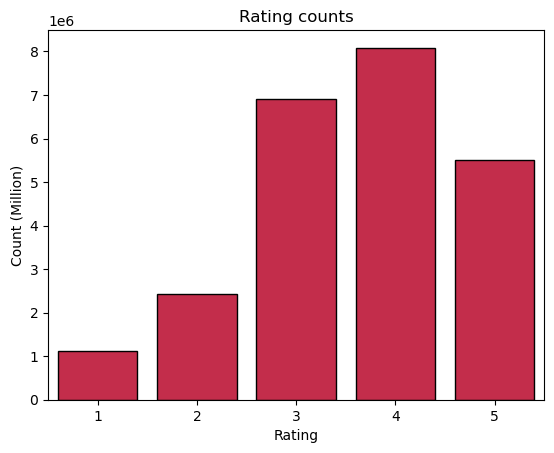

# 📺 Netflix Recommendation System


## 📌 Overview
This project builds a **Netflix-style movie recommendation system** using the [Netflix Prize Dataset](https://www.kaggle.com/netflix-inc/netflix-prize-data).  
We aim to predict **user ratings for unseen movies** and recommend movies a user is most likely to enjoy.

The system uses:
- **Collaborative Filtering** (SVD - Singular Value Decomposition)
- **Python Surprise Library** for modeling and evaluation

---

## 🗂 Dataset
**Source:** Netflix Prize Competition (100M+ ratings)  
**Structure:**
- Multiple `.txt` files (`combined_data_1.txt`, `combined_data_2.txt`, etc.)
- Each file contains:
  - **Movie ID line:** Ends with `:` (e.g., `1:`)
  - **Ratings lines:** `CustomerID,Rating,Date`

**Note:**  
* The raw dataset is **too large for GitHub** and is excluded via `.gitignore`.
* The movie_titles.csv is included in the repo.
* You can download it here: [Netflix Prize Data](https://www.kaggle.com/netflix-inc/netflix-prize-data).

---

## 🛠 Tech Stack
- **Python 3.x**
- **Pandas** → Data cleaning & preprocessing
- **Surprise** → Collaborative filtering & SVD
- **Matplotlib / Seaborn** → Data visualization
- **Jupyter Notebook** → Development environment

---

## 📍 Project Steps
1. **Data Import & Parsing**
   - Read raw `.txt` files
   - Extract Movie IDs & Ratings into a clean dataframe

2. **Exploratory Data Analysis (EDA)**
   - Rating distribution
   - Most rated movies
   - Sparsity of user-movie matrix

3. **Model Building**
   - Apply **SVD** using Surprise library
   - Train-test split for evaluation

4. **Evaluation**
   - Use **RMSE** (Root Mean Squared Error)

5. **Recommendations**
   - Recommend top N unseen movies for a given user

---

## 🚀 How to Run
```bash
# Clone the repository
git clone https://github.com/RehanShaikh-ai/netflix-recommendation-system.git
cd netflix-recommendation-system
```
## **👤 Author**

**Rehan Abdul Gani Shaikh**
**Aspiring Data Scientist | B.Tech Student**

**🔗 Connect with me: LinkedIn**
**📬 Email: rehansk.3107@gmail.com**

